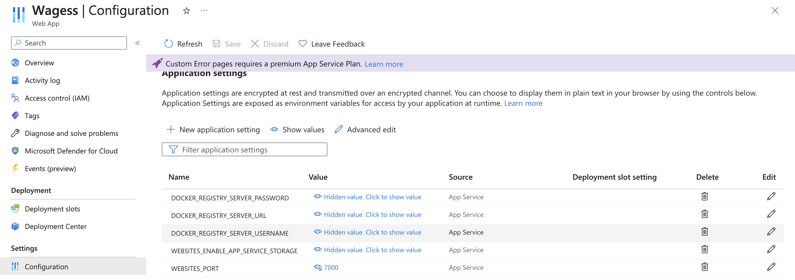

# Data Engineering Group Project [](https://github.com/jaxonyue/DE-Group-Project/actions/workflows/cicd.yml)

- Flask App: https://wagesviz.azurewebsites.net/
- YouTube Demo:

## Team Members

Team: Jaxon Yue, Haochong(Harry) Xia, Vivian Zhang, Eve

## Overview
We use python to build this Flask app in `app.py`. This app provide the diagnosis of the wages change of 38 countries, which includes a data pipeline,a load testing with 10000 request per second, data engineering, and CI/CD integrations.

The Overall Archetecture of our final project is shown as below:

## Purpose
- Microservice:
    Use Python to build a microservice that includes logging and be containerized using the Distroless Docker image and interfaces with a data pipeline.
- Load Test:
    A load test verifies that the microservice is capable of handling 10,000 requests per second.
- Data Engineering:
    Involve the use of a library specializing in data engineering such as Spark, Pandas, SQL, a vector database, or any other relevant library.
- Infrastructure as Code (IaC):
    Utilize an IaC solution among AWS CloudFormation, AWS SAM, AWS CDK, or the Serverless Framework for infrastructure setup and management.
- Continuous Integration and Continuous Delivery (CI/CD):
    Implement a CI/CD pipeline through GitHub Actions.
- README.md
    A comprehensive README file that clearly explains what the project does, its dependencies, how to run the program, its limitations, potential areas for improvement, and how AI Pair Programming tools (GitHub Copilot and one more tool of our choice) were used in your development process.
- Architectural Diagram
    A clear diagram representing the architecture of our application should be included.
- GitHub Configurations
    Must include GitHub Actions and a .devcontainer configuration for GitHub Codespaces. This should make the local version of our project completely reproducible. The repository should also include GitHub Action build badges for install, lint, test, and format actions.
- Quantitative Assessment
    Include a quantitative assessment of its reliability and stability. Use data science fundamentals to describe system performance, e.g., average latency per request at different levels of requests per second (100, 1000, etc.). Think of the software system as a data science problem that needs to be described using data science principles.


## Link to the deployed app:
https://wagesviz.azurewebsites.net/

## File Descriptions
- `app.py`: Flask application
- `Development of Average Annual Wages_1.csv` and `Development of Average Annual Wages_2.csv`: dataset.
- `loadData.py`: load the csv.
- `operations`: SQLite operation on the dataset.
- `Makefile`: Contains commands for setting up the environment, testing, linting, and formatting
- `Dockerfile`: For containerizing the application

## Key components
- **Microservice**: Use Python to deploy a web app that can display tables and line graphs of wages growth of 38 countries.
- **Data Engineering**: Using `SQLite database` to manage wages data.
- **Load Testing**: Test 10000 request per second.
- **Continuous Integration and Continuous Delivery**: Automated using GitHub Actions.
- **Docker**: Containerize the application.
- **locust**: Package used for Loading test.
- **CI/CD**: CI/CD is implemented using GitHub Actions for automated testing and deployment.

## App Introduction
- This app is a simple web app that can provide you a table with wage information and a line graph about the wage growth of the selected country. It includes following features:
1. A title indicates the purpose of this app
2. A button to select which country you are interested in
3. A button to generate the graph

## Key steps to run the application
1. Git clone the repo, the environment will automatically be set up with necessary dependencies installed. If it doesn't, use `make install` to install `requirements.txt`.

2. Loading the data use function `load` in `loadData.py`. The data is stored in `Development of Average Annual Wages_1.csv` and `Development of Average Annual Wages_2.csv`. The database is stored in `wages.db`.

3. Use `python app.py` to run the application locally to verify that it works.

4. Use the following command to log into DockerHub, build docker image and push to container:
```
echo "your_password" | docker login --username your_username --password-stdin
docker build -t <insert member username>/wages .
docker push <insert member username>/wages
docker run -p 7000:7000 wages
```

5. Create a new web app service on Azure, select Docker Container and deploy the DockerHub image.

6. Navigate to **Configuration** -> **Application Settings**, and add `WEBSITES_PORT` with a value of 7000.



7. Run the app using the URL provided by Azure.

## Load test
- We use `locust` to do the load test with several different setting of parameters. `Locust` is an open source load testing tool used to test the performance of web applications. It is designed to be easy to use, highly customizable, and scalable. Locust allows us to simulate the behavior of thousands of concurrent users (virtual users) and measure the performance of our application under different loads.
- We use the following command to run the load test:
```
locust -f load_test.py --host=https://wagesviz.azurewebsites.net
```
- After running the command, we can open the web page `http://localhost:8089/` to see the load test user interface. We can set the number of users and the spawn rate to simulate the load. After clicking the `Start swarming` button, the load test will start. The result will be shown in the web page.

- At the beginning, we are using the basic server plan with only one instance, and we set the number of users to 10000 and the spawn rate to 100. The test result is shown as below:


As we can see, the average RPS(request per second) is about 100, and the maximum is 395.7 with 206.5 failures. The total percentage of faliues is also a little high. In addition, after we adjust the number of users to 100000 and the spawn rate to 1000, it even could't run. Hence, we upgrade the plan of the server in Azure, and increase the number of instance. Although, according to Azure website, the highest instances we should be able to reach is 30, but we only reach 11, and the result did get better.

10000 users with spawn rate of 100:


100000 users with spawn rate of 1000:


Next, we upgrade the plan to the highest one, and we got a pretty good result:


Finally, we adjust the user to 100000 with spawn rate of 1000 and find a suitable waiting time between each request,


The test result is shown as below:


- Analysis: By applying data science principles, we've quantitatively assessed the system's reliability and stability, focusing on average latency, failure rates, and response time percentiles at different levels of load. There were 28,531 failures with 971,573 total requests, resulting in a failure rate of approximately 2.94% (28,531 / 971,573), which is already very low, indicating the robustness of our server. There's a noticeable increase in average latency as the system load goes from 100 Requests/s to 1,000 Requests/s. The increase in average latency suggests that the system may be approaching or experiencing a performance bottleneck as the load intensifies. The system's scalability is a key concern, as it should ideally handle higher loads with minimal impact on latency. In our test result, we notice the wide range between the minimum and maximum response times (30 to 2264875 milliseconds), which is inteersting since we didn't expect the system's performance will be various in this large scale. We think that this may due to the difference of network traffics, which make us to conclude that in order to get a more resonable result, we need to run the test multiple times, and wait enough time for each round of test.


## Limitations
Dataset is samll. We only have 38 countries' wages data. We can add more countries' data to make the app more useful.

## Potential areas for improvement
Use larger dataset.

## Using Copilot and Chatgpt:
- We use copilot in two ways while writing my code:

    1. Press `Cmd+I` on macOS (or `Ctrl+I` on Windows/Linux) to bring up the Chat input to send request to Copilot. After that, we can choose if we acceptthe suggestion from copilot to write the code. In addition, the suggestion will not be fully correct. We need to modify the code to make it correct, but it provide us a template to write our code, which helps us to write code faster with less errors.

    2. Copilot will also suggest some contents automatically while we are writing code. We can press `Tab` to accept the suggestion from copilot, which also helps us to write code faster with less errors.

- For Chatgpt, it is used in the same way as the first way of using copilot. The difference is that Chatgpt can provide suggestions besides the code. However, its suggestions will not be fully correct as well.

- Hence, there are two advantages of using copilot and Chatgpt:
    1. They helps me to write code faster. 
    2. They helps me to write code with less errors. 

## Video
